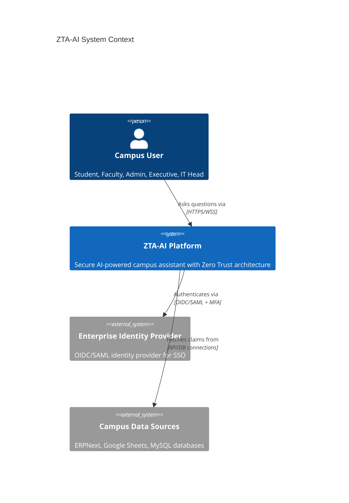
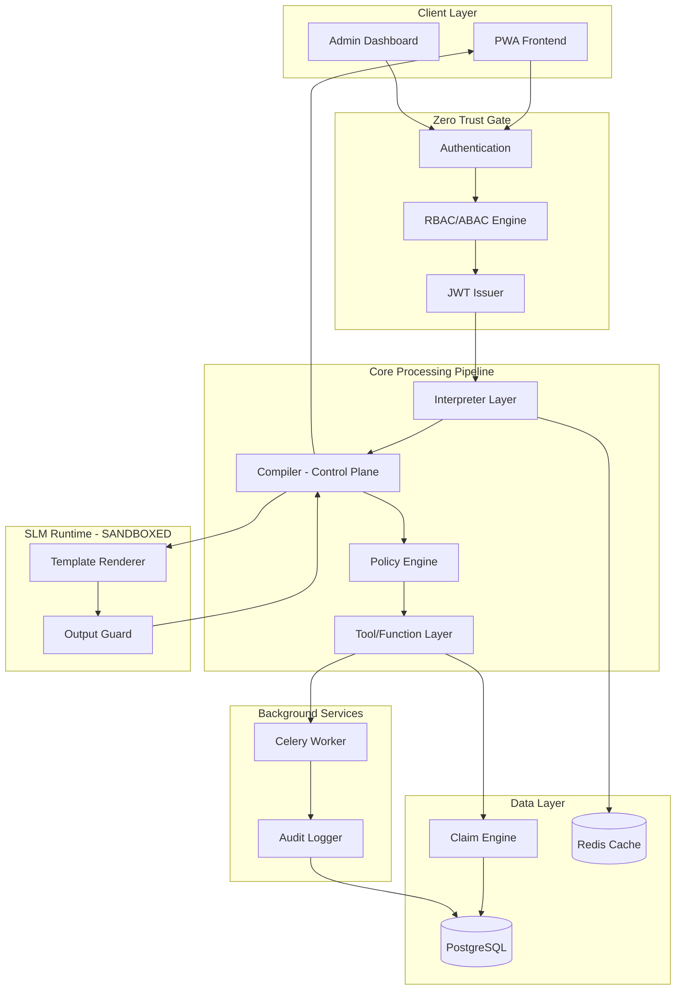
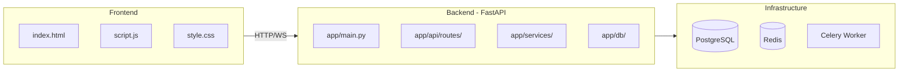
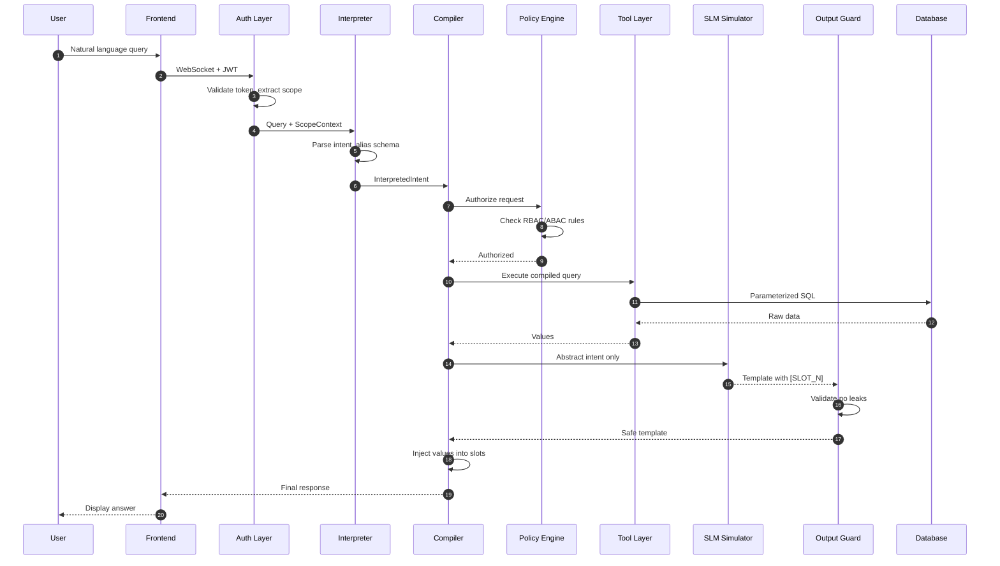
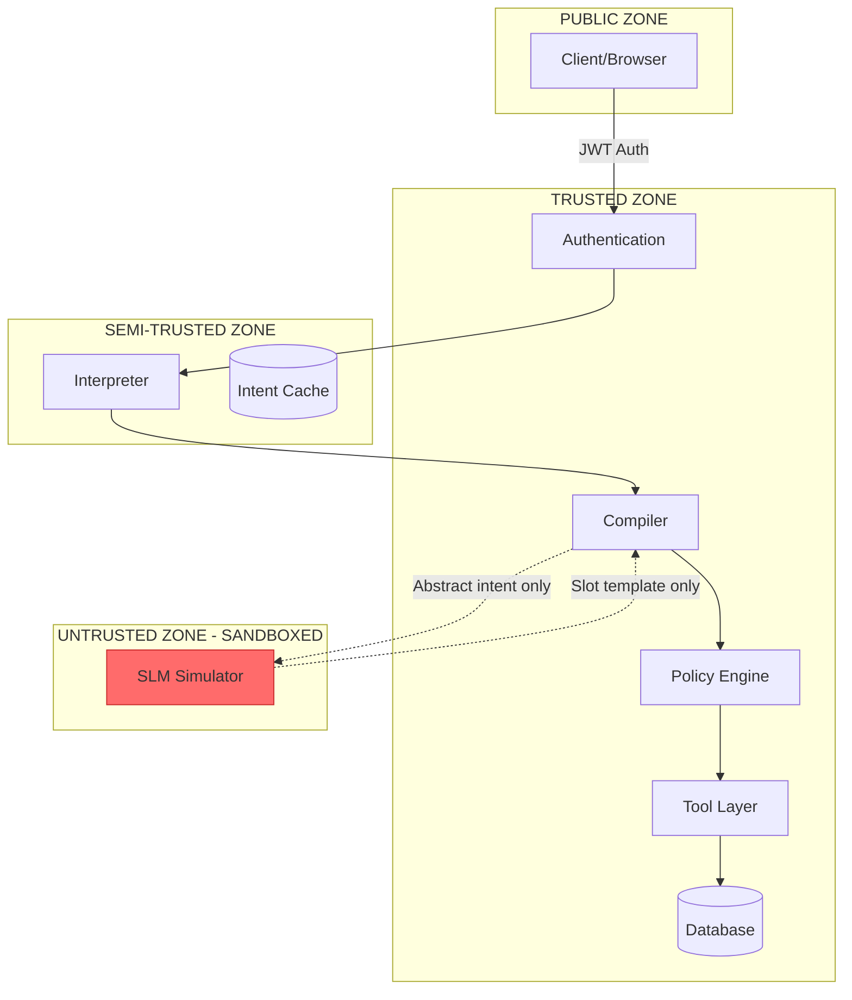
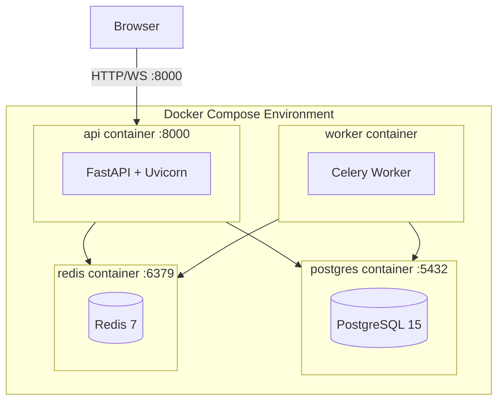
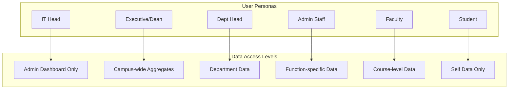

# ZTA-AI High Level Design (HLD)

**Plan Alignment:** This HLD is aligned to `ZTA_AI_FINAL_PRODUCT_PRODUCTION_PLAN.md` (v3.0, April 11, 2026). In case of conflict, use the plan. See `docs/PLAN_ALIGNMENT.md`.

## 1. System Context Diagram

## 2. High-Level Architecture

## 3. Component Overview

## 4. Data Flow - Query Processing

## 5. Security Zones

## 6. Deployment Architecture

## 7. User Personas & Access Hierarchy

