# ZTA-AI Low Level Design (LLD)

**Plan Alignment:** This LLD is aligned to `ZTA_AI_FINAL_PRODUCT_PRODUCTION_PLAN.md` (v3.0, April 11, 2026). If implementation details here diverge from plan requirements, use the plan. See `docs/PLAN_ALIGNMENT.md`.

## 1. Database Schema (ERD)

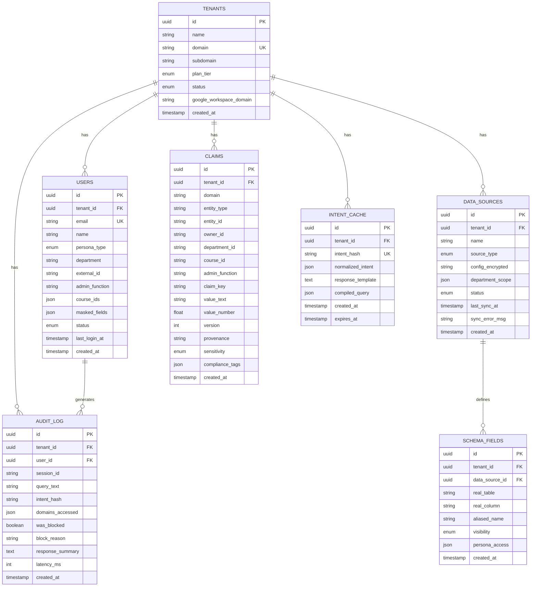

## 2. API Routes Structure

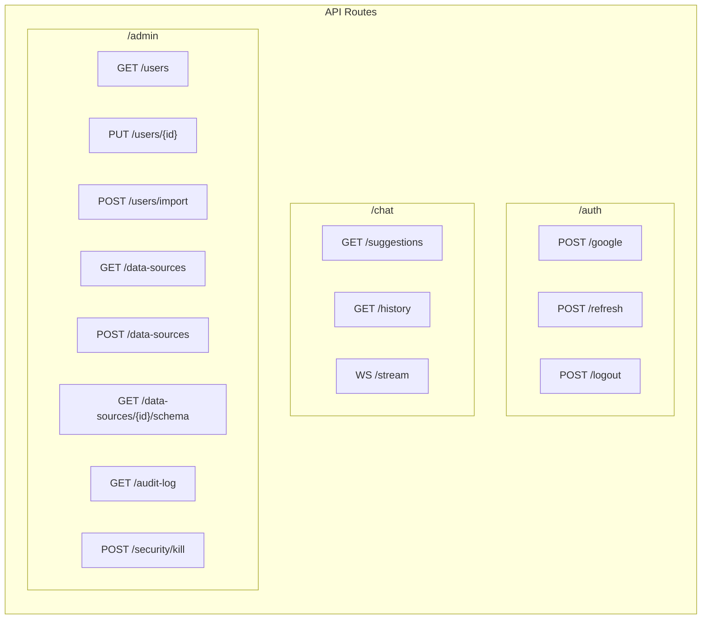

## 3. Authentication Flow

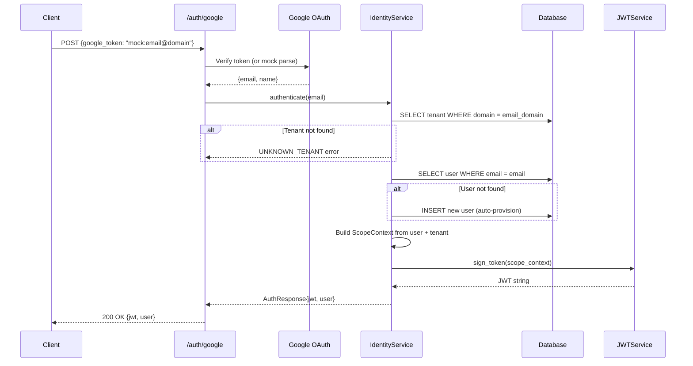

## 4. Pipeline Service - Query Processing

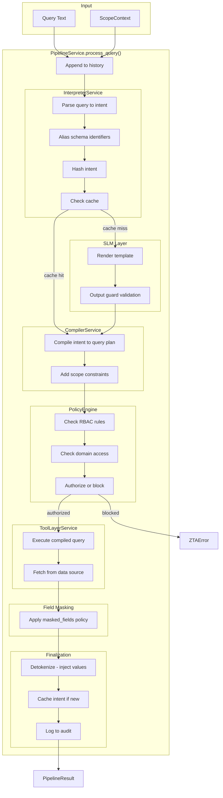

## 5. SLM Simulator - Template Mapping

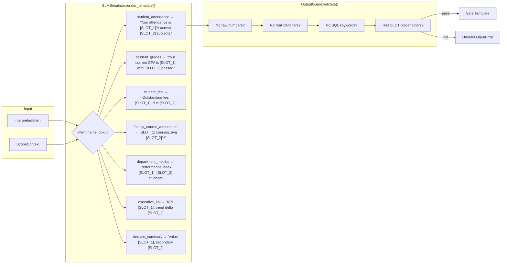

## 6. Policy Engine - Authorization Matrix

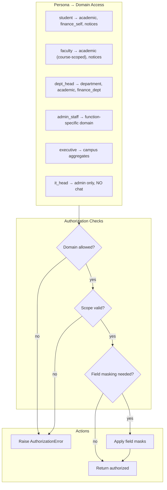

## 7. WebSocket Chat Stream Flow

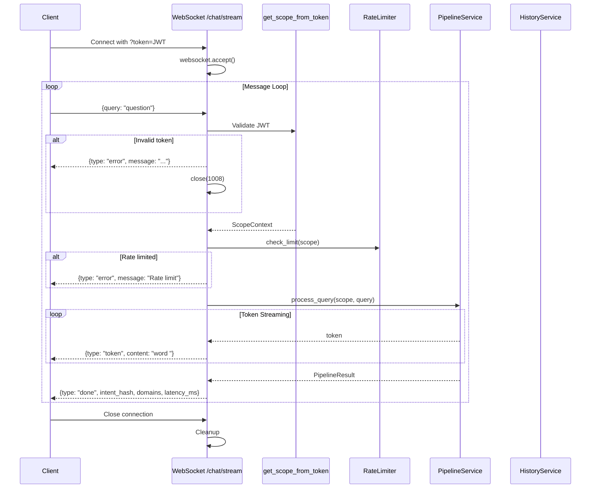

## 8. Celery Task Flow - Audit Logging

```mermaid
flowchart LR
    subgraph Sync["Synchronous Path"]
        API[API Request]
        Service[AuditService.enqueue]
        Queue[Celery Task Queue]
    end

    subgraph Async["Celery Worker"]
        Task[write_audit_event_task]
        Repo[AuditRepository]
        DB[(PostgreSQL audit_log)]
    end

    API --> Service
    Service -->|delay()| Queue
    Queue --> Task
    Task --> Repo
    Repo --> DB
```

## 9. Data Source Connector Architecture

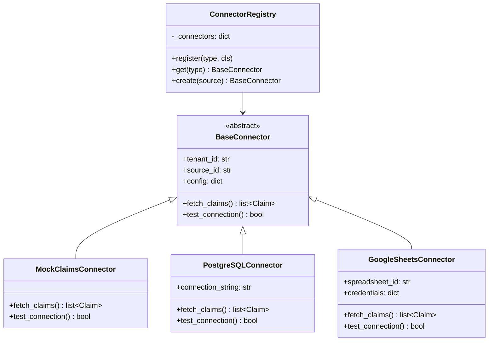

## 10. Class Diagram - Core Services

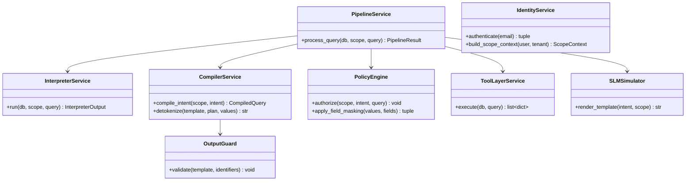

## 11. Error Handling Hierarchy

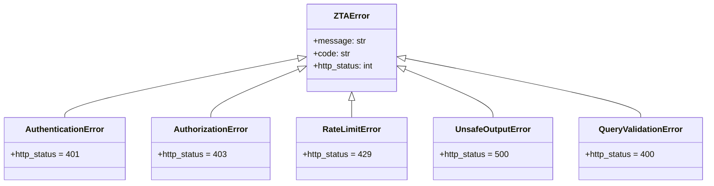

## 12. Request/Response Schemas

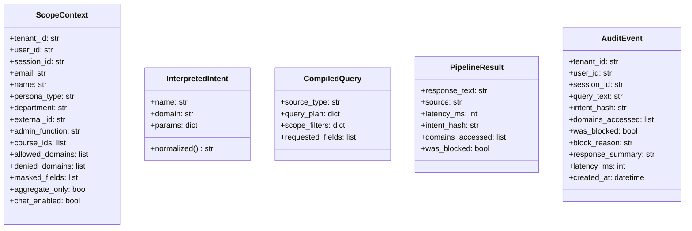
